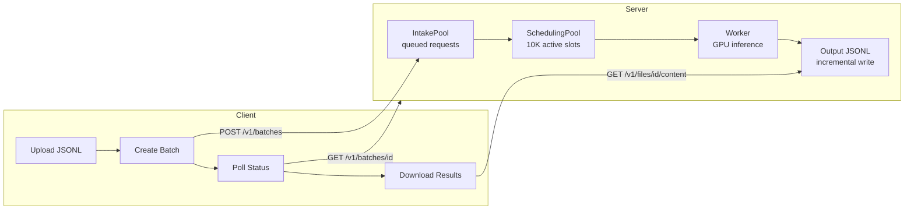
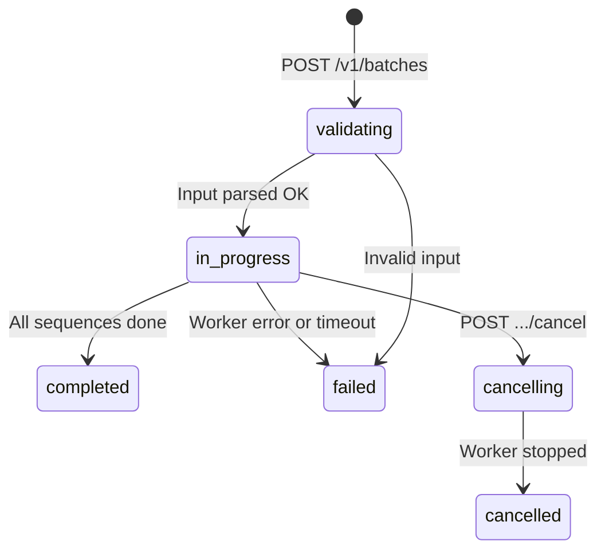
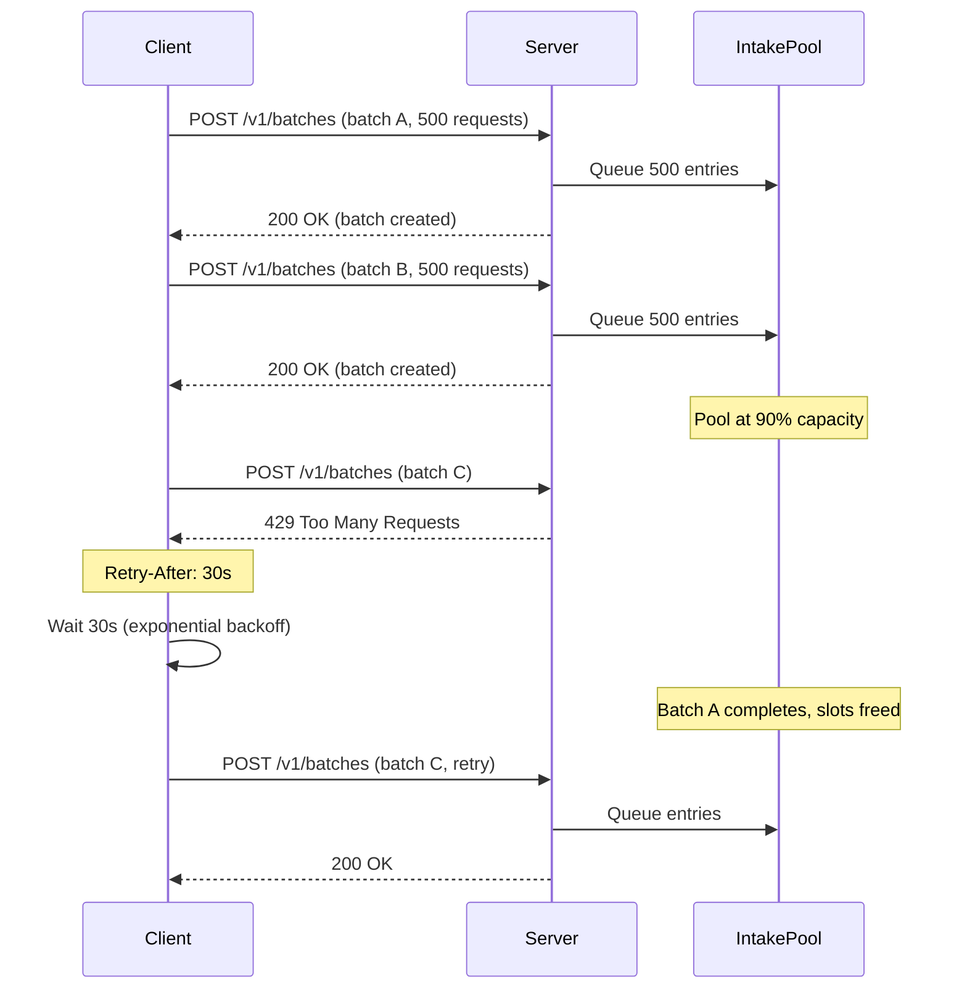

# BatchGen Batch API — User Guide

BatchGen provides an OpenAI-compatible Batch API for large-scale asynchronous inference. Submit thousands of prompts in a single call, and retrieve results when they're ready.

## Architecture



Batches are processed asynchronously. The server queues requests in the **IntakePool**, drains them into the **SchedulingPool** (which manages GPU memory slots), and writes results incrementally as each sequence completes.

## Quick Start

### Python Client

```python
from batchgen.batchgen_client import BatchGenHttpClient

client = BatchGenHttpClient("http://localhost:10900")

# One-liner: upload → create → wait → download
batch = client.submit_batch(
    input_file_path="input.jsonl",
    output_file_path="output.jsonl",
    max_decoding_length=4096,
)
print(f"Status: {batch['status']}")  # "completed"
```

### Step by Step

```python
# 1. Upload input file
file_obj = client.upload_file("input.jsonl", purpose="batch")
print(f"File ID: {file_obj['id']}")

# 2. Create batch
batch = client.create_batch(
    input_file_id=file_obj["id"],
    endpoint="/v1/chat/completions",
    max_decoding_length=4096,
    temperature=0.7,
)
print(f"Batch ID: {batch['id']}, Status: {batch['status']}")

# 3. Poll until complete
batch = client.wait_for_batch(batch["id"], poll_interval=10.0)

# 4. Download results
content = client.download_file_content(batch["output_file_id"])
with open("output.jsonl", "wb") as f:
    f.write(content)
```

### curl

```bash
# Upload
curl -X POST http://localhost:10900/v1/files \
  -F "file=@input.jsonl" \
  -F "purpose=batch"

# Create batch
curl -X POST http://localhost:10900/v1/batches \
  -H "Content-Type: application/json" \
  -d '{"input_file_id": "file-abc123", "endpoint": "/v1/chat/completions", "max_decoding_length": 4096}'

# Check status
curl http://localhost:10900/v1/batches/batch_abc123

# Download output
curl http://localhost:10900/v1/files/file-output123/content -o output.jsonl
```

## Batch Lifecycle



| Status | Meaning |
|--------|---------|
| `validating` | Input JSONL being parsed and validated |
| `in_progress` | Sequences queued for GPU inference |
| `completed` | All results ready; `output_file_id` is set |
| `failed` | Error occurred; check `error` field |
| `cancelling` | Cancel requested, waiting for worker |
| `cancelled` | Batch cancelled; partial results discarded |

## Input JSONL Format

Each line is a JSON object with these fields:

```json
{
  "custom_id": "request-1",
  "method": "POST",
  "url": "/v1/chat/completions",
  "body": {
    "model": "Kimi-K2.5",
    "messages": [
      {"role": "system", "content": "You are a helpful assistant."},
      {"role": "user", "content": "What is 2+2?"}
    ],
    "max_tokens": 4096,
    "temperature": 0.7,
    "top_p": 0.9
  }
}
```

**Required fields:**
- `custom_id` — Your unique identifier. Used to match results to requests (output order is not guaranteed).
- `method` — Must be `"POST"`.
- `url` — Must be `"/v1/chat/completions"` or `"/v1/completions"`.
- `body` — The request payload (same schema as OpenAI's chat/completion API).

### Parameter Priority

Sampling parameters can be set at three levels. Higher priority overrides lower:

| Priority | Source | Example |
|----------|--------|---------|
| 1 (highest) | Per-request `body` in JSONL | `"temperature": 0.3` in one request |
| 2 | Batch-level (in `create_batch()`) | `temperature=0.7` for the whole batch |
| 3 (lowest) | Server default | Greedy decoding if nothing is set |

This means you can set a batch-level default (e.g., `temperature=0.7`) and override it for specific requests that need different settings.

### Output Token Limit

Set `max_tokens` or `max_completion_tokens` per-request in the JSONL body. If neither is set, the batch-level `max_decoding_length` is used as fallback.

## Output JSONL Format

Each line in the output file corresponds to one input request:

```json
{
  "id": "batch_req_abc123",
  "custom_id": "request-1",
  "response": {
    "status_code": 200,
    "request_id": "req_abc123",
    "body": {
      "id": "chatcmpl-xyz",
      "object": "chat.completion",
      "created": 1711234567,
      "model": "Kimi-K2.5",
      "choices": [
        {
          "index": 0,
          "message": {
            "role": "assistant",
            "content": "2 + 2 = 4.",
            "reasoning_content": "The user asked a simple addition..."
          },
          "finish_reason": "stop"
        }
      ],
      "usage": {
        "prompt_tokens": 42,
        "completion_tokens": 128,
        "total_tokens": 170
      }
    }
  },
  "error": null
}
```

**Matching results to requests:** Use the `custom_id` field. Output order may differ from input order because sequences complete at different speeds.

**Error responses:** If a request fails (e.g., prompt too long), the `error` field is set instead of `response`:

```json
{
  "custom_id": "request-5",
  "response": null,
  "error": {
    "code": "context_length_exceeded",
    "message": "Prompt length 200000 exceeds model context 131072"
  }
}
```

## Incremental Results

Results are written to disk **as each sequence completes**, not when the entire batch finishes. This means:

- **Partial results survive crashes.** If the server restarts, completed sequences are preserved.
- **You can read results during processing.** The incremental file is append-only (one JSON line per completion). Safe to `tail -f`.
- **Final output = incremental file.** When you download via `GET /v1/files/{output_file_id}/content`, you get the same file that was written incrementally.

The incremental file is located at `{storage_path}/incremental/{batch_id}.jsonl` on the server.

## Capacity and Backpressure

The server has two capacity limits to prevent overload:

| Layer | Default Capacity | What happens when full |
|-------|-----------------|----------------------|
| **IntakePool** | 1,000,000 requests | New batches rejected (batch status → `failed`, error: `capacity_exceeded`) |
| **SchedulingPool** | 10,240 slots | Draining pauses; intake requests wait in queue |



### Client-side retry

The Python client automatically retries on HTTP 429:
- **Exponential backoff:** 1s, 2s, 4s, 8s, 16s (capped at 60s)
- **Retry-After header:** If the server sends `Retry-After`, that value is used instead
- **Max 5 retries** before raising `RuntimeError`

If you're using `curl` or a custom client, handle 429 yourself with backoff.

## Monitoring

### Pool Status

```bash
curl http://localhost:10900/v1/pool/status
```

```json
{
  "intake_pool_size": 1500,
  "intake_pool_capacity": 1000000,
  "scheduling_pool_active": 128,
  "scheduling_pool_free": 10112,
  "scheduling_pool_capacity": 10240,
  "active_batches": 3,
  "pool_mode": true
}
```

| Field | Meaning |
|-------|---------|
| `intake_pool_size` | Requests waiting to be scheduled |
| `intake_pool_capacity` | Maximum queue depth |
| `scheduling_pool_active` | Requests currently being processed on GPU |
| `scheduling_pool_free` | Available processing slots |
| `active_batches` | Batches still in progress |

**Recommended:** Poll every 30s. Alert if `intake_pool_size / intake_pool_capacity > 0.8`.

### Health Check

```bash
curl http://localhost:10900/health
```

Returns `{"status": "healthy"}` (200) or `{"status": "unhealthy", "reason": "..."}` (503).

## Error Handling

| HTTP Code | When | What to Do |
|-----------|------|-----------|
| **200** | Success | Process the response |
| **400** | Bad input (invalid JSONL, unknown file, duplicate batch) | Fix input and retry |
| **404** | Batch or file not found | Check ID |
| **429** | Server at capacity | Wait and retry (auto-handled by Python client) |
| **500** | Internal error | Report bug |
| **503** | Server unhealthy | Wait for recovery |

**Batch-level failures** (status = `"failed"`): Check the `error` field on the batch object for details. Common causes:
- `capacity_exceeded` — Server had too many requests queued
- `batch_failed` — Worker process encountered an error
- `timeout` — Batch did not complete within 24 hours

## Best Practices

1. **Always use `custom_id`** to match results to inputs. Output order is not guaranteed.

2. **Set `max_tokens` per-request** in the JSONL body, not just at batch level. Different prompts may need different budgets.

3. **Use long `poll_interval`** for large batches (e.g., `poll_interval=30`). Polling too frequently wastes network and server resources.

4. **Monitor `/v1/pool/status`** for capacity planning. If `scheduling_pool_free` is consistently 0, your server is saturated.

5. **Don't resubmit the same file** while a batch is active. The server rejects duplicate active batches per file (400 error). Wait for the current batch to complete or cancel it first.

6. **Handle 429 gracefully.** The Python client does this automatically. If using curl or a custom client, implement exponential backoff.

7. **Check incremental output** for long-running batches. You don't have to wait for the entire batch to finish to see results.

## Limits

| Limit | Default | Server Flag |
|-------|---------|-------------|
| Intake queue depth | 1,000,000 requests | `--max-intake-capacity` |
| Concurrent processing slots | 10,240 | `--max-pool-size` |
| Batch timeout | 24 hours | (completion_window) |
| Per-request context | Model-dependent | `--max-context-length` |

## API Reference

For detailed endpoint specifications, request/response schemas, and all fields, see [Batch REST API Reference](batch-api.md).
