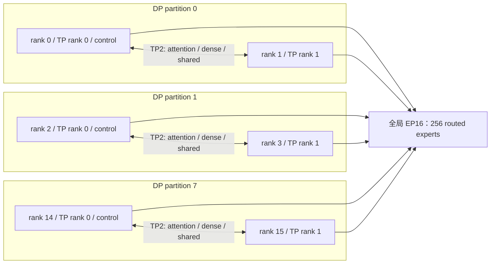
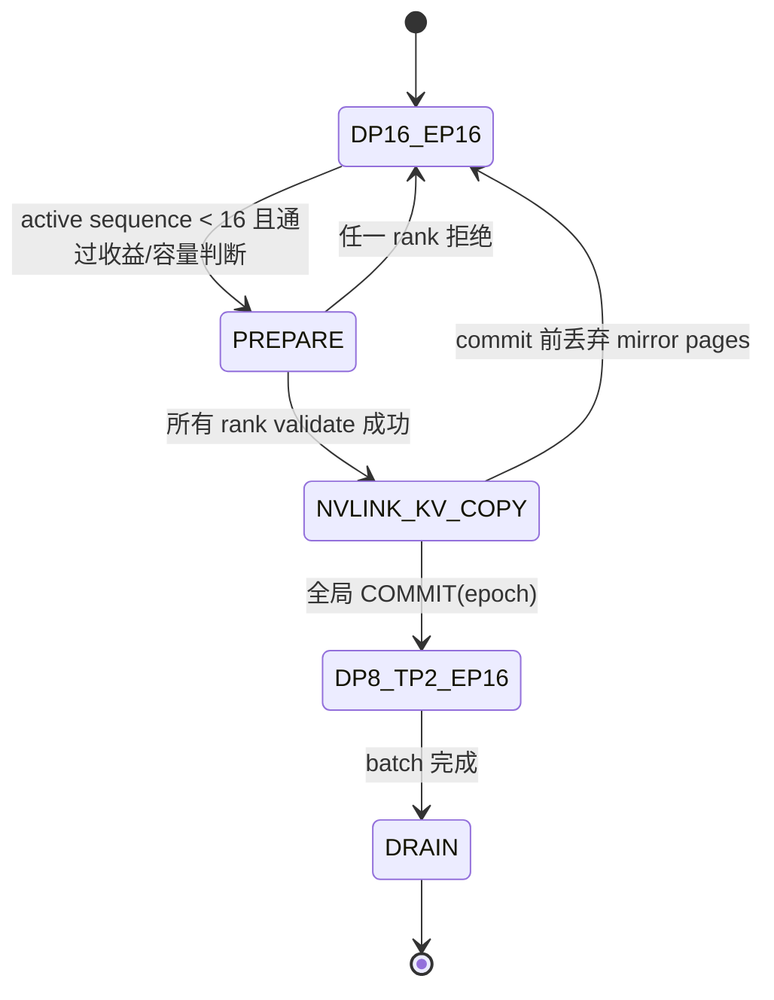

# DeepSeek Decode 运行时动态 Partition 设计

## 1. 结论

本文建议为 DeepSeek-R1/V3 的 decode 增加两种可切换的逻辑布局：

| 布局 | Attention / Dense / Shared Expert | Routed Expert | 适用阶段 |
| --- | --- | --- | --- |
| `DP16_EP16` | 16 路 DP，每个 rank 独立执行自己的 sequence | 保持现有 EP16 | 正常吞吐阶段 |
| `DP8_TP2_EP16` | 8 个 DP partition，每个 partition 内 2 个 rank 做 TP | **仍保持现有 EP16** | 全局运行中 sequence 少于 16 的 decode tail |

这里的关键不是把全局 `world_size` 从 16 改成 8，而是只改变非 routed-expert 部分的执行布局。全局 process group、16 份 routed expert 分片以及 EP collective 始终保持不变。

目标布局如下：

```text
TP group 0: rank  0 + rank  1   -> DP partition 0
TP group 1: rank  2 + rank  3   -> DP partition 1
...
TP group 7: rank 14 + rank 15   -> DP partition 7

Attention / Dense / Shared Expert: DP8 × TP2
Routed Expert:                    EP16
```

本方案只支持单向 tail switch：一个 batch 内允许从 `DP16_EP16` 切到 `DP8_TP2_EP16`，一旦 commit 就保持该布局直到 batch 完成，不设计运行中切回 DP16 的路径。下一个 batch 重新从默认的 `DP16_EP16` 启动。

## 2. 范围

本方案仅支持：

- `DeepseekV3ForCausalLM` 路径，即仓库中的 DeepSeek-R1/V3 实现；
- 硬件仅支持 NVIDIA H20（Hopper）；
- `world_size == 16`、`tp_size == 2`；
- decode 阶段；prefill 始终保持现有 DP16/EP16；
- MLA paged KV 路径，历史 KV 的维度为 `kv_lora_rank + qk_rope_head_dim = 576`；
- 同一 TP group 的两个 rank 位于同一节点，并且能通过 NVLink/NVSwitch 互通；
- 切换时的 KV mirror 必须通过 NVLink 做 GPU-to-GPU 传输，正常路径不经过 host memory；
- batch 在切换前已经 sealed，切换后不再向该 batch admission 新 sequence；
- 第一阶段使用现有 all-gather/all-reduce MoE 路径，不支持 `BATCHGEN_ENABLE_ALL_TO_ALL=1`。

暂不支持 DeepSeek-V2、DeepSeek-V4、GLM、Kimi、MiniMax，也不尝试将本设计抽象成所有模型通用的动态并行框架。

如果在非 `DeepseekV3ForCausalLM` 模型或非 H20 GPU 上打开 feature flag，应在启动阶段直接报错，不能静默进入一个未经验证的通用路径。

## 3. 为什么不能直接把 `world_size` 改成 8

当前 DeepSeek decode 实际上已经是混合并行：

- Attention、dense MLP、shared expert 按 sequence 做 DP；
- 256 个 routed expert 按 16 个 rank 做 EP，每个 rank 持有 16 个 expert；
- MoE 使用全局 all-gather 收集 token，并用全局 all-reduce 合并 expert 输出。

如果运行时直接把 `world_size` 改成 8，会同时破坏：

- `256 // world_size` 的 expert ownership；
- `routed_expert_start_idx/end_idx`；
- MoE buffer 的全局 stride；
- 现有 PyNccl communicator 和 collective 顺序；
- worker 中大量以物理 rank 为下标的 KV、调度和完成状态。

因此动态 partition 必须是一个逻辑布局变化，不能销毁或重建全局 process group。

## 4. 总体架构



需要新增一个 DeepSeek 专用的 `DynamicPartitionManager`，持有：

```python
class ParallelLayout(Enum):
    DP16_EP16 = "dp16_ep16"
    DP8_TP2_EP16 = "dp8_tp2_ep16"

@dataclass(frozen=True)
class PartitionPlan:
    epoch: int
    layout: ParallelLayout
    group_to_uuids: tuple[tuple[str, ...], ...]
    control_rank_by_uuid: dict[str, int]
    previous_owner_by_uuid: dict[str, int]
```

固定拓扑为：

```python
tp_group_id = global_rank // 2
tp_rank = global_rank % 2
tp_group_ranks = (2 * tp_group_id, 2 * tp_group_id + 1)
control_rank = 2 * tp_group_id
```

所有 pair process group 必须在 worker 初始化时由全部 rank 按相同顺序创建，不能在切换过程中调用 `dist.new_group()`。

## 5. Sequence 所有权与执行视图

现有 `assigned_rank` 同时承担调度 ownership、query book ownership 和本地执行过滤，不能简单地让两个 rank 都成为 owner。

建议拆出两个概念：

- **control owner**：唯一负责 sampling、SequenceEntry 状态更新、decoded token 写回、host KV append 和完成上报的 rank；
- **execution rank**：实际参与该 sequence forward 的 rank。

在 `DP16_EP16` 中，两者相同。在 `DP8_TP2_EP16` 中：

- `assigned_rank` 继续表示 control owner，并统一设置为 pair 的偶数 rank；
- pair 内两个 rank 都是 execution rank；
- 两个 rank 使用完全相同、按 `global_idx` 排序的 group batch；
- follower 不写 query book 和 host KV，只维护本轮 forward 所需的临时 token、context length 和 page-table execution view。

建议新增 `DecodeExecutionView`，避免把 follower 的镜像 slot 塞进现有 `_uuid_to_local_map`：

```python
@dataclass
class DecodeExecutionView:
    uuids: list[str]
    global_sequence_ids: list[int]
    latest_tokens: torch.Tensor
    context_lengths: torch.Tensor
    is_control_rank: bool
```

进入 TP 模式时，每个 group 直接合并原来两个 rank 的 sequence：

```text
group(g).sequences = rank(2g).sequences ∪ rank(2g+1).sequences
```

第一阶段不做跨 group 重平衡，因此不需要跨节点迁移 KV。代价是极端情况下 8 个 group 的 batch size 不完全均衡，但所有 KV mirror 都能限制在固定 TP pair 内并走 NVLink。

## 6. 模型切分

### 6.1 MLA Attention

每个 rank 从 128 个 attention head 中计算连续的 64 个 head：

| 权重 | TP2 策略 | 原因 |
| --- | --- | --- |
| `q_a_proj [1536, 7168]` | replicated | 后续每个 head shard 都需要完整 q-lora 表示 |
| `q_b_proj [24576, 1536]` | 按输出 head row-shard | 每个 rank 负责 64 个 Q head |
| `kv_a_proj_with_mqa [576, 7168]` | replicated | 生成共享的 576 维压缩 KV |
| `kv_b_proj [32768, 512]` | 按输出 head row-shard | `q_absorb/out_absorb` 都可按 head 切分 |
| `o_proj [7168, 16384]` | 按输入 head column-shard | 每个 rank 产生 partial hidden output |

每个 rank 的 FlashMLA 使用 `num_heads=64`，`o_proj` 之后在 pair group 内做一次 BF16 all-reduce，得到 replicated 的 `[group_bsz, 7168]` hidden state。

`q_a_proj` 和 `kv_a_proj_with_mqa` 的计算会重复，但它们比完整的 head projection 和 attention 小，第一阶段不为它们额外引入 reduce-scatter/all-gather。

需要特别处理现有 `_fp8_absorb_weights` 缓存：DP128-head 和 TP64-head 必须按 layout 分开缓存，切换时不能复用旧 shape 的 absorb weight。

### 6.2 Dense MLP 与 shared expert

前三个 dense layer 和每个 MoE layer 的 shared expert 使用标准 Megatron 风格 TP：

```text
gate_proj / up_proj: 按 intermediate 输出维 row-shard
down_proj:           按 intermediate 输入维 column-shard
down_proj 输出:      pair 内 all-reduce
```

DeepSeek-R1/V3 的维度都能被 TP2 及 FP8 的 128 block 对齐整除：

- dense intermediate：`18432 / 2 = 9216`；
- shared expert intermediate：`2048 / 2 = 1024`；
- attention heads：`128 / 2 = 64`。

RMSNorm、residual 和 MoE router 保持 replicated。

### 6.3 Routed experts 保持 EP16

Routed experts 不做 TP，也不改变 ownership。rank `r` 仍负责原来的 16 个 expert：

```text
[r * 16, (r + 1) * 16)
```

不能让 TP pair 的两个 rank 都把同一组 sequence 注入全局 MoE，否则每个 token 会被 routed expert 重复计算两次。

TP 模式下采用“leader slot”协议：

1. pair 两边在进入 MoE 前持有相同的 hidden state；
2. 只有 control rank 把 group token 写入全局 EP all-gather input；
3. follower 对应的全局 slot 标为 invalid；
4. 16 个 rank 继续执行各自的 routed experts；
5. 全局 EP all-reduce 后，pair 两边都读取 control rank 对应的 result slice。

伪代码如下：

```python
if layout == ParallelLayout.DP16_EP16:
    ep_input = local_x
    result_owner_rank = global_rank
else:
    ep_input = group_x if tp_rank == 0 else zeros_like(group_x)
    result_owner_rank = tp_group_ranks[0]

global_results = ep_allgather_route_compute_allreduce(ep_input, valid_counts)
out = global_results[
    result_owner_rank * stride : result_owner_rank * stride + group_bsz
]
```

必须把每个 rank 的 `valid_count` 传给 MoE dispatch。仅仅发送零 padding 不够，因为当前 gate 会把 padding token 也路由到 expert。TP follower slot 和普通 padding slot 都必须在 `fused_moe_token_dispatch` 前被 mask 掉，保证 routed expert 实际只计算一次有效 token。

`num_tokens_per_rank` 在 TP 模式下表示 `max_group_bsz`，而不是 follower 的本地输入行数。现有 `_sync_decode_moe_rank_counts()` 需要同时维护：

- 供 collective sizing 使用的 `max_group_bsz`；
- 供 dispatch mask 使用的 16-rank valid-count vector；
- 供 follower 取结果使用的 `result_owner_rank`。

### 6.4 Embedding、LM head 与 sampling

第一阶段保持 embedding 和 LM head replicated，不对 vocab 做 TP：

- pair 两边使用相同 token 做 embedding lookup；
- 只有 control rank 执行 LM head 和 `_select_tokens()`；
- control rank 将 `[group_bsz, 1]` 的 next-token tensor broadcast 给 follower；
- follower 只更新 `DecodeExecutionView.latest_tokens`。

这样 greedy、temperature 和 top-p sampling 都沿用现有实现，并且每个 sequence 仍只有一个 RNG/state owner。后续确认 LM head 成为瓶颈后，再单独增加 vocab parallel；它不应阻塞第一版动态 partition。

## 7. KV Cache 策略

DeepSeek MLA 的 paged KV 是每 token 576 维的压缩表示，不按 attention head 保存。因此历史 KV 不需要从 128-head 格式转换成 64-head 格式。

TP 模式采用 **pair 内完整复制 GPU KV**：

- 两个 rank 为 group 中全部 sequence 建立相同顺序的 page table；
- 偶数 rank 原有 sequence 的 GPU KV 通过 NVLink 复制给奇数 rank，奇数 rank 原有 sequence 的 GPU KV 同时复制给偶数 rank；
- 只复制 peer 当前缺少的 sequence pages，不复制 destination 已经持有的 pages；
- decode 时两边各自更新本地 GPU KV；
- 只有 control rank 通过 `kv_append_callback` 写 shared host KV，follower 禁止写入，避免重复 append 和竞态；
- sequence 完成时两个 rank 都释放 GPU pages，host pages 只由 control rank 释放一次。

### 7.1 NVLink 传输后端

worker 是多进程模型，另一个进程分配的 CUDA pointer 不能直接交给普通 `cudaMemcpyPeerAsync()` 使用，除非额外引入 CUDA IPC handle。因此第一版建议使用 **TP pair 专用 NCCL P2P `send/recv`**，由 NCCL 在已验证的同节点拓扑上走 NVLink/NVSwitch。

启动时必须完成以下检查：

1. pair 两个 rank 属于同一 node；
2. 通过 NVML/topology preflight 确认两张 GPU 之间存在 NVLink 或 NVSwitch 路径；
3. CUDA peer access 可用，NCCL P2P transport 没有被禁用；
4. debug/validation 模式检查 NCCL transport 日志和实测带宽，确认没有退化到 host staging、PCIe 或网络路径。

任一检查失败就禁用动态 partition；不允许自动降级为 host KV reload 或 PCIe copy。

GPU paged KV 的物理 page 通常不连续，因此传输流程为：

```text
source GPU pages
    -> pack kernel
    -> contiguous NVLink send buffer
    -> pair NCCL send/recv over NVLink
    -> contiguous receive buffer
    -> unpack kernel
    -> destination GPU pages
```

建议按 `layer × page chunk` 双缓冲：pack 第 `n+1` 个 chunk 时，同时传输并 unpack 第 `n` 个 chunk，避免一次申请完整 sequence KV 大小的 staging buffer。DeepSeek MLA 没有独立 V cache，需要复制的是 K/compressed-KV page，以及 FP8 KV 模式下与 page 对应的 scale/aux metadata；传输保持原始 dtype，不做反量化。

进入 TP 模式前，对每个 group 做容量检查：

```text
required_pages(group) <= 0.9 * min(total_gpu_pages(rank_a), total_gpu_pages(rank_b))
```

`required_pages(group)` 必须包含 group 全部 sequence 的当前 pages、two-page buffer 和下一次 boundary extension headroom。destination 必须能在保留自身 source pages 的同时分配 peer-missing pages；任一 pair 不满足就跳过本次切换。

同时要求每个 `group_bsz <= BATCHGEN_MAX_DECODE_RANK_BSZ`，并在进入前为 `max_group_bsz` 完成 MoE token-index/buffer resize；不能依赖 forward 中的临时扩容。

KV mirror 的事务顺序为：

1. quiesce decode compute，等待所有仍引用 GPU KV tensor 的 deferred callback/task；
2. 在 destination 为 peer-missing sequence 分配 pages，但保留两边原有 source pages；
3. 交换 source page descriptors 和 destination page descriptors；
4. 通过 dedicated transfer stream 执行 pack、pair NCCL P2P、unpack；
5. 用 CUDA event 等待全部 chunk 完成，并校验 page count、sequence id 以及 GPU checksum；
6. 两边按同一 `global_idx` 顺序 rebuild page table；
7. 所有 pair ready 后才允许全局 `COMMIT(epoch)`。

正常切换路径不读取 host KV。若 commit 前任一步失败，直接释放新分配的 peer-mirror pages；原 source pages 从未释放，因此可以保持原 DP layout。commit 之后不存在切回 DP16 的路径。

## 8. 运行时切换协议

切换只允许发生在现有 `_page_boundary_fast()` 完成之后，此时 batch、completion 和 KV append 已经形成一个全局安全点。



一次 `DP16 -> TP2` transition 的顺序为：

1. rank 0 根据全局 sequence state 生成 `PartitionPlan(epoch + 1)`；
2. broadcast plan hash、group sizes、control owner 和 layout epoch；
3. 各 rank 检查模型类型、NVLink/NVSwitch 拓扑、TP weight、GPU KV 容量、pending load/migration；
4. 用全局 `all_reduce(MIN)` 汇总 prepare 结果；
5. quiesce compute stream、KV append stream 和异步 load；
6. pair 内把 odd-rank query/control state 迁给 even-rank control owner；
7. destination 分配 peer-missing pages，通过 pair NCCL P2P 在 NVLink 上完成 pair 内 GPU KV 互拷；
8. 校验 KV checksum，构建两个 rank 相同的 `DecodeExecutionView` 和 GPU page table；
9. 所有 rank 上报 ready；rank 0 broadcast `COMMIT(epoch)`；
10. 从下一次完整 model forward 开始使用新 layout，直到 batch 完成；禁止在一个 layer 中途切换。

每个 collective 都必须携带或校验同一个 `layout_epoch`。任何 rank 的 epoch 不一致都应立即 fail-fast，不能继续进入 NCCL collective。

## 9. 触发策略

“运行中 sequence 数量少于卡数”是必要条件，但不应该是唯一条件。当前 routed MoE 即使在某些 rank 没有本地 sequence 时仍会使用全部 16 张卡；TP2 能加速的是 attention、dense MLP 和 shared expert，同时会新增 pair all-reduce 和 KV mirror 成本。

定义：

```text
N_active = 当前 IN_DECODE 且未完成的全局 sequence 数
eligible = 0 < N_active < 16
```

第一阶段建议附加以下硬条件：

- 当前没有 `QUEUEING`、`PREFILLED`、`ON_HOLD` 或 pending async load；
- batch 已 sealed，确认切换后不会再 admission；
- 所有 pair 的 GPU KV 容量检查通过；
- dual-layout TP weight 已经准备好；
- 连续两个 boundary 都满足条件，避免瞬时抖动；
- 预计剩余 decode step 足以摊销 transition。

收益判断可以使用：

```text
switch_cost_ms + remaining_steps * ema_tp_step_ms
    < remaining_steps * ema_dp_step_ms * (1 - min_gain_ratio)
```

没有历史 EMA 时，使用离线 profile 表，key 至少包含：

- `N_active` 和 `max_group_bsz`；
- context-length bucket；
- greedy 或 sampling；
- KV dtype。

建议提供 force 模式用于功能测试，但生产默认必须走收益判断。配置项可设计为：

```text
--deepseek-dynamic-partition
--deepseek-dynamic-partition-enter-below 16
--deepseek-dynamic-partition-min-remaining-steps 128
--deepseek-dynamic-partition-min-gain-ratio 0.10
--deepseek-dynamic-partition-force
```

切换成功后不再执行触发判断，也不响应 `N_active` 回升。新请求必须等待当前 batch 完成，并在下一个以 `DP16_EP16` 启动的 batch 中处理。

## 10. 权重布局与 HBM

为了让切换不重建整个 model，建议在 `configure_decoding()` 时准备 dual layout：

- DP 权重保持现状；
- row-shard 后天然连续的 `q_b_proj`、`kv_b_proj`、`gate_proj`、`up_proj` 使用 view；
- column-shard 后不连续的 `o_proj`、`down_proj` 创建 TP 专用 contiguous pack；
- FP8 `weight_scale_inv` 按相同的 128 block 边界切片；
- routed expert 权重不复制、不切片；
- wrapper 根据 `ParallelLayout` 选择 DP 或 TP weight view。

TP pack 必须在 `_init_gpu_kv_with_actual_size()` 之前分配，使现有“模型加载后再计算实际 GPU KV 容量”的逻辑能够自动扣除这部分 HBM。

如果某张卡无法同时容纳 DP 权重、TP pack 和最低 GPU KV buffer，则该 rank 在 prepare 阶段投反对票，整个功能保持 DP16。不要在 transition 中临时从 Parameter Server 重载 61 层权重。

长期可以增加支持 K-offset/strided weight 的 FP8 GEMM，去掉 `o_proj/down_proj` 的 contiguous pack；第一阶段不必为此扩大 kernel 修改范围。

## 11. 每层 collective 顺序

所有 rank 必须保持下面的固定顺序，包括没有有效 sequence 的 rank：

```text
1. Attention local-head compute
2. TP pair all-reduce(attention output)
3. 如果是 dense layer：TP pair all-reduce(dense MLP output)
4. 如果是 MoE layer：
   a. shared expert TP partial compute
   b. global EP16 all-gather(valid leader tokens)
   c. local routed expert compute
   d. global EP16 all-reduce(routed output)
   e. 两个 TP rank 都读取 leader result slice
   f. TP pair all-reduce(shared expert output)
   g. routed + shared + residual
```

pair group 可以使用独立 NCCL communicator，但第一版建议所有操作都在明确的 stream/event 依赖下串行，先保证 collective 顺序正确。确认无死锁后再 overlap shared expert TP 和 routed EP。

空 group 也必须进入全局 EP collective。pair 内 TP collective 可以使用固定的一行 zero dummy buffer，避免零元素 NCCL 调用在不同版本上的行为差异。

## 12. 正确性约束

实现中应把以下条件写成运行时断言：

1. 所有 global rank 的 `layout` 和 `layout_epoch` 相同；
2. 一个 TP pair 的 `uuids/global_sequence_ids/context_lengths` 完全相同且顺序一致；
3. 每个 sequence 只有一个 control owner；
4. follower 不执行 sampling、不写 decoded token、不 append/release host KV；
5. pair 两边 page table 的 sequence order 相同；
6. TP 模式下只有 leader slot 的 token 被标为 MoE valid token；
7. routed expert ownership 始终按全局 rank/16 计算；
8. `cache_seqlens <= gpu_pages_allocated * PAGE_SIZE` 在 pair 两边都成立；
9. transition 前没有 pending KV append/load/migration；
10. layout 只能在完整 forward 之间切换。

数值上不要求 DP 和 TP bitwise identical，因为 TP all-reduce 会改变 BF16 累加顺序；但 greedy 生成应在回归语料上保持 token 一致，并同时记录 logits 的 max/mean error。

## 13. 代码改动建议

| 文件 | 改动 |
| --- | --- |
| `batchgen/models/deepseek/deepseekv3/dynamic_partition.py` | 新增 layout、plan、收益判断和 transition state machine |
| `batchgen/models/deepseek/deepseekv3/tp_layers.py` | DeepSeek FP8 TP linear、dense/shared MLP 和 weight view |
| `batchgen/models/deepseek/deepseekv3/Parallel_Strategy_Manager.py` | 初始化 pair groups、构建 dual weight layout、warmup TP kernel |
| `batchgen/models/deepseek/deepseekv3/wrappers.py` | Attention wrapper 按 layout 选择 128-head DP 或 64-head TP backend |
| `batchgen/attention/mla/flashmla_backend.py` | 支持 local head range、64-head metadata、TP `o_proj` partial output |
| `batchgen/models/deepseek/deepseekv3/modeling_deepseek_v3.py` | MoE leader-slot、valid mask、shared expert TP 和 follower result slice |
| `batchgen/batchgen_worker.py` | boundary hook、execution view、control-state transfer、NVLink KV mirror、token broadcast |
| `batchgen/kv_cache/gpu_paged_kv_manager.py` | 导出 page descriptor，分配 peer-mirror pages，提供 pack/unpack 接口 |
| `core/GPU_KV_Buffer/` 或新的 C++/CUDA 扩展 | KV page pack/unpack、chunk buffer 和 GPU checksum |
| `batchgen/worker/decode.py` / `boundary.py` | TP 模式按 group capacity 调度，leader capacity 取 pair 两边最小值 |
| `batchgen/server/server_args.py` | DeepSeek 专用 feature flags 和参数校验 |

动态选择不应放进 `DeepSeekV3Planner`。Planner 负责启动时静态容量配置，真正的 layout state 和 transition 必须属于 decode runtime。

## 14. 实施阶段

### Phase 0：算子可行性验证

- 单层 MLA：128-head DP 输出对比 2 × 64-head + all-reduce；
- dense/shared MLP：完整 GEMM 对比 TP2；
- MoE：验证 leader slot 只 dispatch 一份 token，follower 能读取 leader result；
- 测量每层 TP all-reduce 与全局 EP 的时序。

### Phase 1：单批次 one-way tail switch

- 仅 sealed batch；
- 只支持 `DP16_EP16 -> DP8_TP2_EP16`；
- 没有 queue/prefilled/on-hold 时才进入；
- KV 只通过 pair NCCL P2P 在 NVLink/NVSwitch 上复制，不允许 host/PCIe fallback；
- batch 完成后销毁 execution view；
- 先禁用 all-to-all 和 DeepSeek CUDA graph；
- 不做跨 group sequence rebalance。

这是建议首先合入的版本。

### Phase 2：性能优化

- topology-aware group rebalance；
- KV pack/NVLink/unpack 双缓冲和多 layer pipeline；
- shared expert 与 routed EP overlap；
- 去掉 column-shard contiguous weight pack；
- 可选 vocab-parallel LM head；
- 为 DP/TP layout 分别捕获 CUDA graph。

## 15. 测试与验收

### 单元测试

- `N_active = 0, 1, 8, 15, 16` 的 trigger；
- H20 正常启用，任何非 H20 GPU 在启动校验阶段拒绝启用；
- rank 到 TP group/control rank 的映射；
- group union、stable ordering 和 owner transfer；
- pair GPU KV 容量拒绝；
- plan hash/epoch 不一致 fail-fast；
- MoE valid-count mask 不计算 follower/padding token；
- NVLink topology 不满足时拒绝切换；
- commit 前传输失败时丢弃 mirror pages，并保持原 ownership/page table。

### 分布式正确性测试

- 2-rank toy layer 验证 attention、dense、shared expert TP；
- 16-rank DeepSeek-R1 强制在 `16 -> 15 -> 8 -> 1` sequence 变化时切换；
- context length 覆盖 2K、8K、32K 和 page boundary；
- BF16/FP8 KV 各跑一组；
- greedy token 对比纯 DP16 baseline；
- temperature/top-p 验证只有 control rank 消耗 RNG；
- 空 group、单 sequence group 和双 sequence group 不死锁；
- BF16/FP8 KV page 和 FP8 scale/aux metadata 的 NVLink 复制正确；
- transition 时注入 pack、NCCL send/recv、unpack 和 checksum failure，验证 commit 前回滚；
- commit 后持续运行到 batch 完成，确认不存在返回 DP16 的状态边。

### 性能验收

仅在目标 H20 环境测量：

- `N_active = 1, 2, 4, 8, 12, 15`；
- DP step latency、TP step latency、transition latency；
- attention、TP communication、global EP、shared expert、LM head 的占比；
- NVLink KV mirror 的 pack、传输、unpack 时间和有效 GB/s；
- HBM 中 DP weight、TP pack、GPU KV 的分项占用；
- transition 需要多少 step 才能摊销。

生产策略只有在实测 `predicted_gain > min_gain_ratio` 时启用。若 `N_active=12/15` 因 TP collective 反而更慢，应让收益模型跳过，而不是为了满足 `N_active < 16` 强制切换。

## 16. 主要风险与规避

| 风险 | 规避方式 |
| --- | --- |
| TP 和 EP communicator 顺序不一致导致死锁 | 启动时创建固定 pair groups；layout epoch；所有 rank 固定每层 collective 顺序 |
| follower 重复路由 token，MoE 计算翻倍 | leader-slot + valid-count mask，不能只用 zero padding |
| host KV 被两个 rank 重复 append | 只有 control rank 注册 host `kv_append_callback` |
| TP mirror 使 GPU KV 容量不足 | transition 前按 pair 最小容量做硬检查；失败保持 DP |
| NCCL 没有走 NVLink/NVSwitch | 启动时做 NVML topology preflight；验证 P2P transport/带宽；不允许 host、PCIe 或 network fallback |
| paged KV 非连续导致大量小消息 | GPU pack/unpack + 有界 chunk 双缓冲，每个 chunk 使用 pair NCCL grouped P2P |
| KV 复制中途失败破坏源数据 | destination 单独分配 pages，source pages 保留到 commit；失败只释放 mirror pages |
| FP8 scale 切片错位 | 所有 shard 强制 128 block 对齐，并对 weight/scale shape 做断言 |
| 旧 128-head absorb cache 被 TP backend 复用 | absorb cache 按 layout/local-head-range 分开 |
| 切换成本大于 tail 收益 | EMA/离线 profile 收益模型和最小剩余 step 门槛 |

## 17. 最终建议

先实现 `DP16_EP16 -> DP8_TP2_EP16` 的 one-way decode tail switch，并把以下三点作为第一版不可妥协的边界：

1. 全局 EP16 和 `world_size=16` 永远不变；
2. DeepSeek MLA GPU KV 通过 TP pair 内的 NVLink/NVSwitch 直接复制，正常切换路径不经过 host memory；
3. MoE 只从 pair leader 注入一次有效 token，follower 读取 leader result slice。

切换 commit 后保持 `DP8_TP2_EP16` 直到 batch 完成，不实现运行时切回 DP16。这条路径对现有 routed expert、Parameter Server 和全局 communicator 的侵入最小，也是最容易先证明正确、再逐步优化性能的方案。
